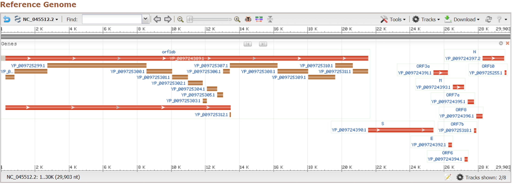

# Sequences Resources of SARS-CoV-2

> UPDATE: 2020-03-14

## How many Genome/Protein Sequences are there?

### Notice in NGDC

> There are 563 isolates and 577 2019-nCoV sequences in NGDC.

### Notice in NCBI/GenBank

> Data regarding the SARS-CoV-2 (Severe acute respiratory syndrome coronavirus 2, 2019-nCoV) outbreak sequences can be found in `GenBank/SRA`, the `NCBI Virus resource`, and a specialized `BLAST` page that searches Betacoronavirus sequences.

Hence we got following links:

#### Latest sequence data in GenBank

> <https://www.ncbi.nlm.nih.gov/genbank/sars-cov-2-seqs/>

This page is a summary of 'raw' data resources:

* Submit Sequence Data
* PubMed Articles
* ClinicalTrials.gov
* Nucleotide Sequences (165 entries)
* SRA Sequences (41 entries)
* Reference Genome
* Other Resources

From the view we can find that there are currently 15 proteins (brown bar) defined.

#### NCBI Virus resource

> <https://www.ncbi.nlm.nih.gov/labs/virus/vssi/#/virus?SeqType_s=Nucleotide&VirusLineage_ss=Wuhan%20seafood%20market%20pneumonia%20virus,%20taxid:2697049&utm_campaign=wuhan_nCoV&utm_source=insights&utm_medium=referral>

This page provide a summary/MetaData of nucleotide sequences and protein sequences. You can download related resources, perform sequence alignment and build phylogenetic tree via this page.

MetaData have been save in `MetaData of Genome Sequences.csv` and `MetaData of Protein Sequences.csv`.

All nucleotide sequences and protein sequences are stored in `./Genome` and `./Protein` respectively.

#### Top search result of term "SARS-CoV-2" by GenBank (2020-03-14) 

> NCBI Reference Sequence: NC_045512.2: <https://www.ncbi.nlm.nih.gov/nuccore/1798174254>

NC_045512.2 is defined as the reference genome currently.